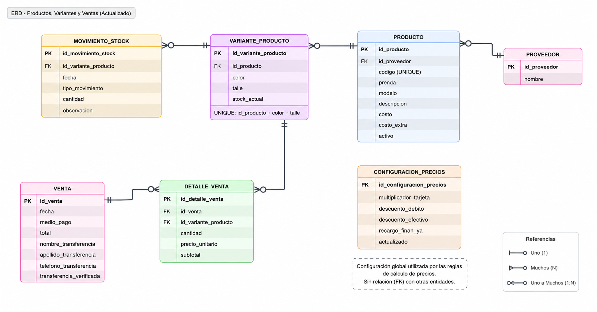

# Sistema de Gestión de Ventas y Stock

Aplicación web para la gestión de ventas, productos e inventario de una tienda de indumentaria.

El proyecto surge a partir del análisis de un proceso real actualmente gestionado mediante diferentes hojas de cálculo. El objetivo es centralizar la información, reducir tareas manuales y mantener actualizado el stock automáticamente a partir de las operaciones realizadas.

> Los datos utilizados en el repositorio son ficticios. No se publica información comercial real del negocio analizado.

## Problema

Actualmente, la gestión se realiza mediante diferentes archivos y hojas de cálculo para productos, precios, ventas y stock.

Entre los principales problemas identificados se encuentran:

- actualización manual del stock;
- información distribuida entre diferentes archivos;
- posibilidad de inconsistencias entre ventas y existencias;
- procesos manuales durante el registro de ventas;
- falta de trazabilidad sobre los movimientos del inventario;
- dificultad para obtener información consolidada sobre ventas y stock.

## Solución propuesta

Desarrollar una aplicación web que permita centralizar la gestión de:

- proveedores;
- productos;
- variantes por color y talle;
- precios según medio de pago;
- inventario;
- movimientos de stock;
- ventas y sus detalles.

Al confirmar una venta, el sistema valida la disponibilidad, calcula los importes correspondientes, registra la operación, descuenta automáticamente el stock y genera el movimiento de inventario asociado.

## Tecnologías

### Backend

- Python
- Django
- Django REST Framework
- PostgreSQL
- drf-spectacular
- OpenAPI / Swagger

### Frontend

El frontend se incorporará en una etapa posterior del proyecto utilizando React.

## Arquitectura del backend

El backend separa las diferentes responsabilidades de la aplicación:

```text
Cliente / Frontend
       ↓
    API REST
       ↓
     Views
       ↓
  Serializers
       ↓
    Services
       ↓
     Models
       ↓
  PostgreSQL
```

Los `services` contienen las operaciones de negocio que involucran múltiples acciones, como el registro de una venta y la actualización correspondiente del inventario.

## Modelo de datos

El sistema utiliza las siguientes entidades principales:

- Proveedor
- Producto
- VarianteProducto
- MovimientoStock
- Venta
- DetalleVenta



La separación entre `Producto` y `VarianteProducto` permite representar diferentes combinaciones de color y talle manteniendo un único código general de producto.

La entidad `MovimientoStock` conserva el historial de las modificaciones del inventario, mientras que `stock_actual` permite consultar rápidamente la disponibilidad de cada variante.

## Funcionalidades implementadas

Actualmente se encuentran implementadas:

- gestión de proveedores;
- gestión de productos;
- gestión de variantes por color y talle;
- cálculo automático de precios según medio de pago;
- registro de ventas con múltiples artículos;
- validación de stock disponible;
- actualización automática del stock al realizar una venta;
- generación automática de movimientos de stock;
- transacciones atómicas para evitar ventas parcialmente procesadas;
- API REST para inventario y ventas;
- documentación interactiva de la API mediante Swagger;
- administración mediante Django Admin.

## Reglas de negocio principales

- El código de cada producto debe ser único.
- La combinación producto + color + talle debe ser única.
- No se permite vender una cantidad superior al stock disponible.
- Una venta debe contener al menos un artículo.
- Los cambios producidos por una venta se ejecutan dentro de una única transacción.
- Los movimientos históricos de stock no pueden crearse libremente desde la API general.
- Los productos pueden desactivarse sin eliminar su información histórica.

## Cálculo de precios

Las reglas utilizadas inicialmente son:

```text
Precio tarjeta = (Costo × 2,5) + Costo extra
Precio débito = Precio tarjeta - 15 %
Precio efectivo / transferencia = Precio tarjeta - 20 %
Precio Fast Cred = Precio efectivo
Precio Finan Ya = Precio efectivo + 5 %
```

En futuras versiones estas reglas podrán convertirse en parámetros configurables.

## Documentación de la API

Durante el desarrollo, Swagger se encuentra disponible en:

```text
/api/docs/
```

El esquema OpenAPI se encuentra disponible en:

```text
/api/schema/
```

## Instalación local

### 1. Clonar el repositorio

```bash
git clone https://github.com/AgosBracaccini/gestion-stock-ventas
cd gestion-stock-ventas
```

### 2. Crear y activar un entorno virtual

Windows:

```bash
python -m venv venv
venv\Scripts\activate
```

### 3. Instalar las dependencias

```bash
pip install -r requirements.txt
```

### 4. Configurar las variables de entorno

Crear un archivo `.env` en la raíz tomando como referencia `.env.example`.

```env
DB_NAME=gestion_tienda
DB_USER=postgres
DB_PASSWORD=your_password
DB_HOST=localhost
DB_PORT=5433
```

Los valores deben adaptarse a la configuración local de PostgreSQL.

### 5. Aplicar las migraciones

```bash
cd backend
python manage.py migrate
```

### 6. Ejecutar el servidor

```bash
python manage.py runserver
```

La aplicación backend estará disponible por defecto en:

```text
http://127.0.0.1:8000/
```

## Documentación adicional

En la carpeta [`docs`](docs/) se encuentra documentación relacionada con:

- análisis de la situación inicial (AS-IS);
- requerimientos;
- modelo de datos;
- decisiones de diseño.

## Estado del proyecto

🚧 Proyecto en desarrollo.

### Próximas mejoras

- gestión de ingreso de mercadería;
- búsqueda y filtrado de productos;
- pruebas automatizadas;
- mejoras en validaciones y manejo de errores;
- dashboards e indicadores;
- desarrollo del frontend en React;
- integración completa frontend/backend.

## Autor

Agostina Bracaccini

Proyecto desarrollado como parte de la construcción de un portfolio personal orientado al desarrollo de software.