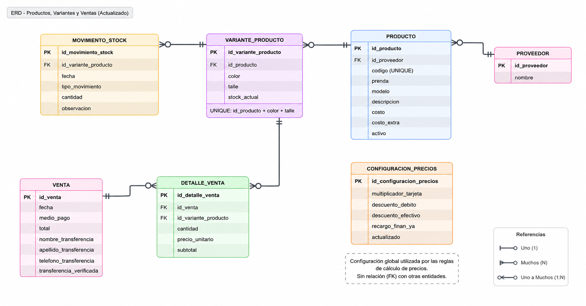
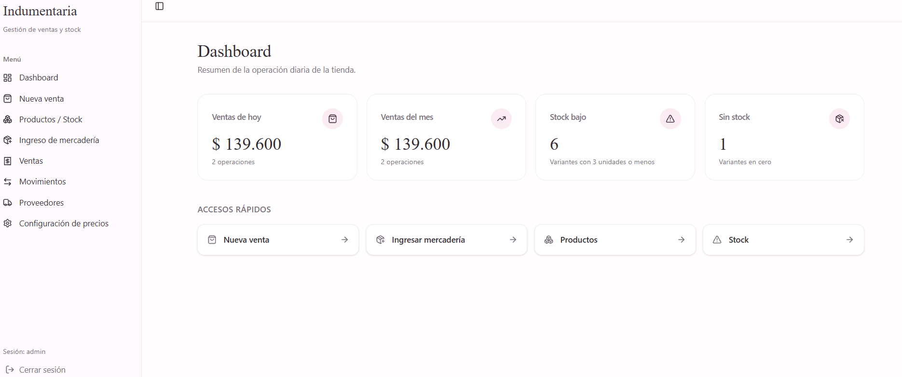
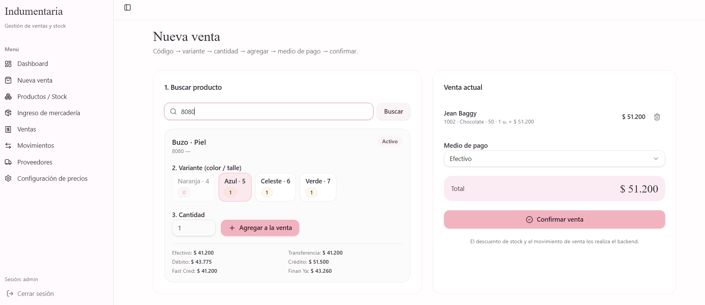
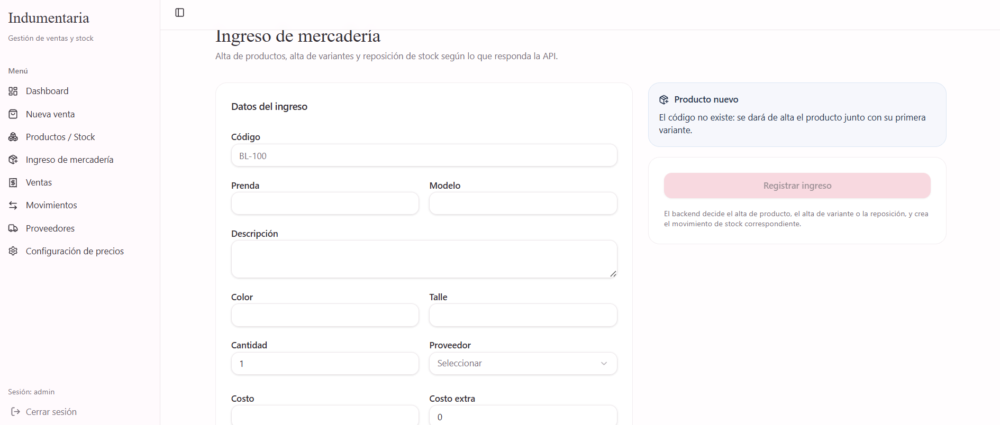
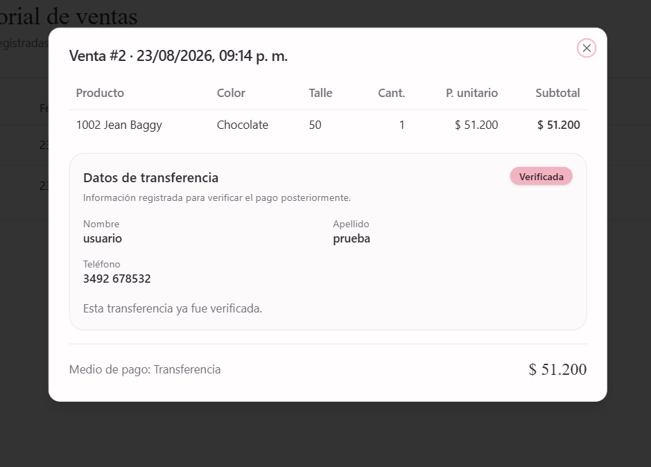

# Sistema de Gestión de Ventas y Stock

Aplicación web para la gestión de ventas, productos e inventario de una tienda de indumentaria.

El proyecto surge a partir del análisis de un proceso real actualmente gestionado mediante diferentes hojas de cálculo. El objetivo es centralizar la información, reducir tareas manuales y mantener actualizado el stock automáticamente a partir de las operaciones realizadas.

> Los datos utilizados en el repositorio son ficticios. No se publica información comercial real del negocio analizado.

## Problema

Actualmente, la gestión se realiza mediante diferentes archivos y hojas de cálculo para productos, precios, ventas y stock.

Entre los principales problemas identificados se encuentran:

- actualización manual del stock;
- información distribuida entre diferentes archivos;
- posibilidad de inconsistencias entre ventas y existencias;
- procesos manuales durante el registro de ventas;
- falta de trazabilidad sobre los movimientos del inventario;
- dificultad para obtener información consolidada sobre ventas y stock.

## Solución propuesta

Desarrollar una aplicación web que permita centralizar la gestión de:

- proveedores;
- productos;
- variantes por color y talle;
- precios según medio de pago;
- inventario;
- movimientos de stock;
- ingreso y reposición de mercadería;
- ventas y sus detalles;
- personalización de la tienda (nombre y color);
- diseño e impresión de etiquetas de precio;
- cajas de depósito identificadas con códigos QR;
- importación del catálogo y del stock desde los archivos Excel existentes.

Al confirmar una venta, el sistema valida la disponibilidad, calcula los importes correspondientes, registra la operación, descuenta automáticamente el stock y genera el movimiento de inventario asociado.

## Tecnologías

### Backend

- Python
- Django
- Django REST Framework
- PostgreSQL
- Simple JWT
- django-filter
- django-cors-headers
- drf-spectacular
- OpenAPI / Swagger

### Frontend

- React
- TypeScript
- Vite
- React Router
- TanStack React Query
- Tailwind CSS
- Componentes UI reutilizables

## Arquitectura

La aplicación se encuentra separada en frontend y backend.

```text
Usuario
   ↓
React + Vite
   ↓
Cliente HTTP / JWT
   ↓
API REST
   ↓
Django REST Framework
   ↓
Services
   ↓
Models
   ↓
PostgreSQL
```

El frontend se encarga de la interfaz de usuario, la navegación, la gestión de la sesión y el consumo de la API REST.

El backend concentra las reglas de negocio, validaciones, cálculos, operaciones transaccionales y persistencia de datos.

Los `services` contienen las operaciones de negocio que involucran múltiples acciones, como el registro de una venta, el ingreso de mercadería y las actualizaciones correspondientes del inventario.

Las operaciones críticas se ejecutan mediante transacciones para evitar modificaciones parciales de la información ante un error.

Las reglas críticas de negocio permanecen en el backend y no se duplican en el frontend.

## Modelo de datos

El sistema utiliza las siguientes entidades principales:

- Proveedor
- Producto
- VarianteProducto
- MovimientoStock
- Venta
- DetalleVenta
- ConfiguracionPrecios
- ConfiguracionTienda
- ConfiguracionEtiqueta
- Caja
- CajaItem



La separación entre `Producto` y `VarianteProducto` permite representar diferentes combinaciones de color y talle manteniendo un único código general de producto.

La entidad `MovimientoStock` conserva el historial de las modificaciones del inventario, mientras que `stock_actual` permite consultar rápidamente la disponibilidad de cada variante.

La entidad `ConfiguracionPrecios` centraliza los parámetros utilizados para calcular los precios correspondientes a los distintos medios de pago. Esto permite modificar las reglas comerciales desde el sistema sin necesidad de alterar el código fuente.

Las entidades incorporadas en la segunda etapa son:

- `ConfiguracionTienda`: nombre, color e intensidad de la tienda. Existe un único registro, que se aplica a toda la interfaz.
- `ConfiguracionEtiqueta`: diseño de las etiquetas de precio (forma, tamaño, estilo, colores, tipografía, textos y posición). También existe un único registro.
- `Caja`: unidad de almacenamiento del depósito, con un número automático, un nombre opcional y un código público aleatorio (UUID) que se utiliza en el QR.
- `CajaItem`: contenido de una caja, formado por una variante de producto y una cantidad.

## Funcionalidades implementadas

### Autenticación

- Inicio de sesión mediante JWT.
- Access token y refresh token.
- Renovación automática de sesión.
- Rutas protegidas.
- Cierre de sesión.
- Manejo de sesión expirada.

### Productos e inventario

- Gestión de proveedores.
- Gestión de productos.
- Variantes por color y talle.
- Código único por producto.
- Combinación única producto + color + talle.
- Consulta de stock actual.
- Búsqueda de productos y variantes.
- Filtros por proveedor, estado, color y talle.
- Identificación de variantes con stock bajo o sin stock.

### Ingreso de mercadería

El sistema contempla tres escenarios:

1. Producto nuevo + variante nueva.
2. Producto existente + variante nueva.
3. Producto existente + variante existente.

En una reposición de una variante existente se incrementa el stock sin crear registros duplicados.

Los datos generales de un producto existente no se modifican automáticamente durante una reposición.

Cada ingreso genera un movimiento de stock de tipo `ENTRADA`.

### Ventas

- Registro de ventas con uno o múltiples artículos.
- Selección de variantes por color y talle.
- Consulta de stock disponible.
- Selección del medio de pago.
- Visualización del precio correspondiente al medio de pago.
- Cálculo automático de subtotales y total.
- Validación de stock.
- Rechazo de cantidades inválidas.
- Rechazo de productos inactivos.
- Rechazo de variantes inexistentes.
- Rechazo de variantes repetidas dentro de una venta.
- Descuento automático del stock.
- Generación automática de movimientos `VENTA`.
- Operaciones transaccionales con rollback ante errores.
- Registro de nombre, apellido y teléfono del cliente en ventas realizadas mediante transferencia.
- Estado de verificación para transferencias.
- Posibilidad de marcar posteriormente una transferencia como verificada.
- Conservación de los datos necesarios para contactar al cliente ante inconvenientes con la acreditación del pago.

### Medios de pago

El sistema contempla los siguientes medios de pago:

- Efectivo.
- Transferencia.
- Tarjeta de débito.
- Tarjeta de crédito.
- Fast Cred.
- Finan Ya.

El precio de cada artículo se actualiza automáticamente en la interfaz de acuerdo con el medio de pago seleccionado.

Para las ventas mediante **Fast Cred** y **Finan Ya**, el sistema permite acceder a la plataforma externa correspondiente antes de confirmar la operación. Una vez procesado el pago externamente, el usuario confirma su realización y puede completar el registro de la venta.

En las ventas mediante **transferencia**, el sistema solicita:

- nombre del cliente;
- apellido del cliente;
- teléfono.

Estos datos permiten realizar posteriormente la verificación de la acreditación del pago y disponer de información de contacto ante cualquier inconveniente.

Las transferencias se registran inicialmente como pendientes de verificación y pueden marcarse posteriormente como verificadas desde el historial de ventas.

### Consultas e historial

- Historial de ventas.
- Detalle de artículos de cada venta.
- Historial de movimientos de stock.
- Dashboard con importe vendido durante el día.
- Dashboard con importe vendido durante el mes.
- Cantidad de operaciones del día y del mes.
- Indicadores de stock bajo y sin stock.
- Consulta de los datos asociados a ventas por transferencia.
- Visualización del estado pendiente/verificado de las transferencias.
- Verificación posterior de pagos realizados mediante transferencia.

### Personalización de la tienda

- Nombre de la tienda configurable, visible en toda la aplicación y en la pantalla de inicio de sesión.
- Color a elegir entre seis opciones (rosa, celeste, verde, violeta, mostaza y gris) y tres intensidades (suave, medio y fuerte).
- El color se aplica a toda la interfaz mediante variables CSS definidas en un único lugar.
- La lectura de la configuración de la tienda es pública, para poder mostrar el nombre y el color antes de iniciar sesión.

### Etiquetas de precio

- Diseñador de etiquetas con vista previa en tiempo real: forma (rectangular, cuadrada o circular), tamaño en centímetros, estilo de borde, colores, degradé, tipografía, tamaño de los textos, subtítulo y posición del nombre de la tienda.
- Generador de etiquetas por lote: se busca el producto por código, se elige la variante y la cantidad, y se arma una lista.
- Impresión en hojas A4 aprovechando el espacio disponible, con la misma lógica de dibujo en la vista previa y en la impresión.
- Permite reimprimir etiquetas que se despegan de las prendas, sin necesidad de ingresar mercadería nueva.

### Cajas de depósito con QR

- Alta de cajas con número automático y nombre opcional.
- Carga del contenido de cada caja (variantes y cantidades), con validación contra el stock disponible.
- Cada caja tiene un código público aleatorio (UUID) que no puede adivinarse a partir del número de la caja.
- El QR se genera en el navegador y se imprime para pegarlo en la caja.
- Al escanear el QR se accede a una página de solo lectura con el contenido de la caja, sin iniciar sesión y sin necesidad de abrirla.
- El resto de las operaciones sobre cajas (listar, crear, eliminar) requieren autenticación.

### Importación desde Excel

- Importación del catálogo (hoja de precios): crea o actualiza productos y proveedores a partir de código, descripción, costo, costos extras y proveedor. Los precios no se importan porque el sistema los calcula a partir del costo.
- Importación del stock (hoja `stock`): crea o actualiza las variantes a partir de código, color, talle y cantidad.
- Los encabezados se interpretan sin distinguir mayúsculas ni tildes.
- Las filas con errores no detienen la importación: se informan en pantalla y pueden corregirse a mano desde la misma página.
- Si un código de stock no corresponde a un producto existente, se puede crear el producto completando prenda, costo y proveedor.
- Pensada principalmente como carga inicial de los datos existentes.

### API y calidad

- API REST desarrollada con Django REST Framework.
- Persistencia mediante PostgreSQL.
- Documentación OpenAPI / Swagger.
- CORS configurado para la comunicación con el frontend.
- Manejo de errores HTTP.
- Pruebas automatizadas del backend.
- Validación del rollback transaccional.
- Build de producción del frontend verificado.

## Capturas del sistema

### Dashboard

Resumen de ventas e inventario con métricas obtenidas a partir de los datos reales registrados en el sistema.



### Nueva venta

Registro de ventas con selección de variantes, control de stock, cálculo de precios según medio de pago y actualización automática del inventario.



### Ingreso de mercadería

Alta de productos, creación de nuevas variantes y reposición de stock mediante un único flujo integrado con el backend.



### Historial y verificación de transferencias

Consulta del detalle de las ventas y seguimiento del estado de los pagos realizados mediante transferencia.



## Reglas de negocio principales

- El código de cada producto debe ser único.
- La combinación producto + color + talle debe ser única.
- Una reposición de mercadería de un código existente no modifica automáticamente los datos generales del producto.
- No se permite vender una cantidad superior al stock disponible.
- No se permiten cantidades de venta iguales o inferiores a cero.
- Una venta debe contener al menos un artículo.
- Una misma variante no puede aparecer más de una vez dentro de una misma venta.
- No se permite vender un producto inactivo.
- No se permite realizar una venta utilizando una variante inexistente.
- Los cambios producidos por una venta se ejecutan dentro de una única transacción.
- Ante un error durante una venta, la operación completa se revierte.
- Los movimientos históricos de stock no pueden crearse libremente desde la API general.
- Los productos pueden desactivarse sin eliminar su información histórica.
- Los endpoints protegidos requieren un usuario autenticado.

## Cálculo y configuración de precios

Las reglas utilizadas inicialmente fueron obtenidas a partir del análisis del proceso existente:

```text
Precio tarjeta = (Costo × 2,5) + Costo extra
Precio débito = Precio tarjeta - 15 %
Precio efectivo / transferencia = Precio tarjeta - 20 %
Precio Fast Cred = Precio efectivo
Precio Finan Ya = Precio efectivo + 5 %
```

## Autenticación

La API utiliza autenticación mediante JSON Web Tokens (JWT).

El usuario obtiene un `access token` y un `refresh token` mediante:

```text
POST /api/token/
```

El access token debe enviarse en las solicitudes a endpoints protegidos mediante el encabezado:

```text
Authorization: Bearer <access_token>
```

Cuando el access token expira puede obtenerse uno nuevo mediante:

```text
POST /api/token/refresh/
```

El frontend administra la sesión y realiza la renovación automática del access token cuando corresponde.

Los endpoints principales de inventario y ventas requieren autenticación.

## Documentación de la API

Durante el desarrollo, Swagger se encuentra disponible en:

```text
http://127.0.0.1:8000/api/docs/
```

El esquema OpenAPI se encuentra disponible en:

```text
http://127.0.0.1:8000/api/schema/
```

Swagger permite explorar y probar los endpoints de la API, incluyendo aquellos protegidos mediante JWT.

## Pruebas automatizadas

El backend cuenta con pruebas automatizadas para las principales reglas de negocio.

Entre los comportamientos comprobados se encuentran:

- operaciones de inventario;
- creación de productos y variantes mediante el ingreso de mercadería;
- reposición de variantes existentes;
- actualización del stock;
- protección de los datos generales del producto durante una reposición;
- registro de ventas;
- descuento automático de stock;
- generación de movimientos de inventario;
- rechazo de ventas con stock insuficiente;
- rechazo de variantes inexistentes;
- rechazo de productos inactivos;
- rechazo de variantes duplicadas dentro de una venta;
- rollback completo ante errores durante una operación;
- cálculo de precios según medio de pago;
- acceso protegido mediante JWT;
- acceso exitoso de usuarios autenticados.

Para ejecutar todos los tests:

```bash
cd backend
python manage.py test
```

## CORS

Durante el desarrollo local, el backend permite solicitudes provenientes del frontend ejecutado mediante Vite en:

```text
http://localhost:5173
http://127.0.0.1:5173
```

Esta configuración permite desarrollar frontend y backend de manera independiente manteniendo la API protegida.

### Acceso desde otros dispositivos de la red local

Para probar la aplicación desde otro dispositivo de la misma red (por ejemplo, escanear con un celular el QR de una caja), el backend debe iniciarse escuchando en todas las interfaces:

```bash
python manage.py runserver 0.0.0.0:8000
```

Luego se abre la aplicación desde el otro dispositivo usando la IP del equipo, por ejemplo `http://192.168.0.10:5173`.

Mientras `DEBUG = True`, el backend acepta cualquier host y cualquier origen de la red local, y el frontend calcula solo la dirección del backend a partir de la dirección con la que se abrió. Esto no debe mantenerse en producción.

## Instalación local

### 1. Clonar el repositorio

```bash
git clone https://github.com/AgosBracaccini/gestion-stock-ventas
cd gestion-stock-ventas
```

### 2. Crear y activar el entorno virtual del backend

Windows:

```bash
python -m venv venv
venv\Scripts\activate
```

### 3. Instalar las dependencias del backend

```bash
pip install -r requirements.txt
```

### 4. Configurar las variables de entorno del backend

Crear un archivo `.env` en la raíz tomando como referencia `.env.example`.

```env
DB_NAME=gestion_tienda
DB_USER=postgres
DB_PASSWORD=your_password
DB_HOST=localhost
DB_PORT=5433
```

Los valores deben adaptarse a la configuración local de PostgreSQL.

### 5. Aplicar las migraciones

```bash
cd backend
python manage.py migrate
```

### 6. Crear un usuario administrador

```bash
python manage.py createsuperuser
```

Este usuario puede utilizarse para acceder a Django Admin y autenticarse inicialmente contra la API.

### 7. Ejecutar el backend

Desde la carpeta `backend`:

```bash
python manage.py runserver 0.0.0.0:8000
```

El backend estará disponible en:

```text
http://127.0.0.1:8000/
```

### 8. Instalar las dependencias del frontend

Abrir una segunda terminal y ubicarse en la carpeta `frontend`:

```bash
cd frontend
npm install
```

### 9. Configurar las variables de entorno del frontend

Crear un archivo `.env` dentro de `frontend`:

```env
# Opcional: si se omite, se usa el mismo equipo desde el que se abrió la app (puerto 8000)
# VITE_API_URL=http://127.0.0.1:8000
VITE_FAST_CRED_URL=https://ventapp.fastcred.ar/login
VITE_FINAN_YA_URL=https://clientes.finanya.com.ar:9634/index.php

```

### 10. Ejecutar el frontend

Desde la carpeta `frontend`:

```bash
npm run dev
```

El frontend estará disponible en:

```text
http://localhost:5173/
```

Para utilizar el sistema durante el desarrollo deben permanecer ejecutándose simultáneamente el backend y el frontend.

## Build del frontend

Para verificar o generar el build de producción:

```bash
cd frontend
npm run build
```

## Estructura general

```text
gestion-stock-ventas/
│
├── backend/
│   ├── config/
│   ├── inventario/
│   ├── ventas/
│   └── manage.py
│
├── frontend/
│   ├── src/
│   │   ├── api/
│   │   ├── auth/
│   │   ├── components/
│   │   ├── pages/
│   │   ├── App.tsx
│   │   └── main.tsx
│   └── package.json
│
├── docs/
│   ├── images/
│   ├── as-is.md
│   ├── modelo-datos.md
|   ├── frontend.md
│   └── requerimientos.md
│
├── .env.example
├── requirements.txt
└── README.md
```

## Documentación adicional

En la carpeta [`docs`](docs/) se encuentra documentación relacionada con:

- análisis de la situación inicial (AS-IS);
- requerimientos del sistema;
- modelo de datos;
- decisiones de diseño;
- arquitectura e integración del sistema.

## Estado del proyecto

### V1 finalizada

La primera versión funcional del sistema se encuentra implementada, integrada y probada.

La aplicación funciona mediante la siguiente arquitectura:

```text
React + TypeScript + Vite
        ↓
      API REST
        ↓
Django REST Framework
        ↓
    PostgreSQL

Segunda etapa

Sobre la V1 se incorporaron cuatro módulos, desarrollados cada uno en su propia rama y fusionados mediante pull request:

personalización de la tienda;
etiquetas de precio;
cajas de depósito con QR;
importación desde Excel.
Limitaciones conocidas y trabajo futuro
Dirección de los QR: el QR contiene la dirección desde la que se abrió la aplicación. En una red local con IP dinámica, un QR impreso deja de funcionar si cambia la IP del equipo. Soluciones posibles: reservar una IP fija en el router o publicar el sistema con un dominio propio.
HTTPS y configuración de producción: el desarrollo se realiza sobre HTTP. Para producción es necesario usar HTTPS, desactivar DEBUG, restringir ALLOWED_HOSTS y los orígenes CORS, y mover SECRET_KEY a una variable de entorno.
Pruebas automatizadas: los módulos de la segunda etapa se probaron manualmente. Las pruebas automatizadas actuales cubren las reglas de inventario y ventas de la V1.
Historial de ventas en Excel: no se importa. La importación contempla solo el catálogo y el stock.

```

## Autor

Agostina Bracaccini

Proyecto desarrollado como parte de la construcción de un portfolio personal orientado al desarrollo de software.